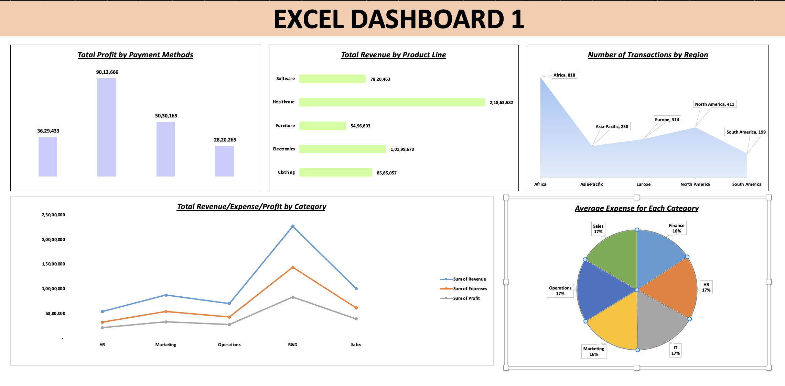

# 📊 Excel Sales Performance Dashboard

An interactive **Sales Performance Dashboard** built in **Microsoft Excel** using Pivot Tables, Pivot Charts, Slicers, and Dashboard Design techniques. This dashboard transforms raw transactional data into meaningful business insights, enabling organisations to monitor revenue, profit, expenses, customer transactions, and regional performance.

---

# 📷 Dashboard Preview

<p align="center">
  
</p>


---

# 📌 Project Overview

This project analyzes sales transactions and presents key business metrics through an interactive Excel dashboard.

The dashboard enables business users to:

- Monitor Total Revenue
- Track Total Profit
- Analyse Business Expenses
- Compare Product Line Performance
- Evaluate Regional Transactions
- Analyse Department-wise Performance
- Study Payment Method Trends

Interactive slicers allow users to filter the dashboard instantly for deeper analysis.

---

# 🎯 Business Problem

Organisations generate thousands of sales transactions every month. Without proper visualisation, it becomes difficult to answer important business questions such as:

- Which payment method generates the highest profit?
- Which product line contributes the highest revenue?
- Which department performs the best?
- Which region has the highest customer activity?
- How are revenue, expenses, and profit related?
- Which department has the highest operational cost?

This dashboard provides a centralised solution for answering these questions using Excel.

---

# 🛠 Tools Used

- Microsoft Excel
- Pivot Tables
- Pivot Charts
- Slicers
- Data Cleaning
- Dashboard Design
- Conditional Formatting

---

# 📂 Dataset Information

The dataset contains approximately **2,000 sales transactions** with the following fields:

| Column |
|----------|
| Transaction ID |
| Transaction Date |
| Revenue |
| Expenses |
| Profit |
| Category |
| Region |
| Department |
| Product Line |
| Customer Segment |
| Payment Method |
| Discount |

---

# 📊 Dashboard KPIs

## 💰 Total Profit by Payment Method

Displays the profit generated through different payment methods.

### Insights

- Cash generated the highest overall profit.
- Credit Card ranks second.
- Bank Transfer and PayPal contributed comparatively lower profits.

---

## 📦 Total Revenue by Product Line

Compares revenue across different product lines.

### Insights

- Healthcare generated the highest revenue.
- Electronics ranked second.
- Furniture generated the lowest revenue.

---

## 📈 Revenue vs Expenses vs Profit

Compares financial performance across business departments.

### Insights

- R&D recorded the highest revenue.
- Sales generated strong profitability.
- HR had the lowest overall financial contribution.

---

## 🌍 Number of Transactions by Region

Shows customer transaction distribution across regions.

### Insights

- Africa recorded the highest transaction count.
- North America ranked second.
- South America had the lowest number of transactions.

---

## 🥧 Average Expense by Department

Analyses operational expenses across departments.

### Insights

- Departmental expenses remain fairly balanced.
- HR, IT, Operations, and Sales show similar average expenses.

---

# 🎛 Dashboard Filters

The dashboard includes interactive slicers for dynamic analysis.

Available filters include:

- Region
- Department
- Product Line
- Payment Method
- Customer Segment
- Transaction Date

---

# 📈 Charts Used

- Column Chart
- Horizontal Bar Chart
- Line Chart
- Area Chart
- Pie Chart

---

# 💡 Key Business Insights

- Cash is the most profitable payment method.
- Healthcare contributes the highest revenue.
- R&D generates the strongest financial performance.
- Africa records the highest number of customer transactions.
- Department-wise expenses remain relatively balanced.
- Interactive filters enable fast business analysis.

---

# 📁 Repository Structure

```
excel-sales-performance-dashboard/
│
├── Dataset.xlsx
├── Sales Dashboard.xlsx
├── Dashboard.png
├── README.md
```

---

# 🚀 How to Use

1. Download the Excel workbook.
2. Open it in Microsoft Excel (2019 or Microsoft 365).
3. Navigate to the Dashboard worksheet.
4. Use slicers to filter the data.
5. Explore business KPIs interactively.

---

# 📚 Excel Skills Demonstrated

- Data Cleaning
- Data Analysis
- Pivot Tables
- Pivot Charts
- Dashboard Design
- Slicers
- Data Visualisation
- KPI Reporting
- Business Intelligence

---

# 🎯 Learning Outcomes

This project demonstrates how Microsoft Excel can be used as a Business Intelligence tool to transform raw transactional data into actionable business insights.

---

# 👨‍💻 Author

**Harsh Kumar**

Aspiring Data Analyst

### Skills

- Microsoft Excel
- SQL
- Power BI
- Python
- Data Visualisation
- Business Intelligence


